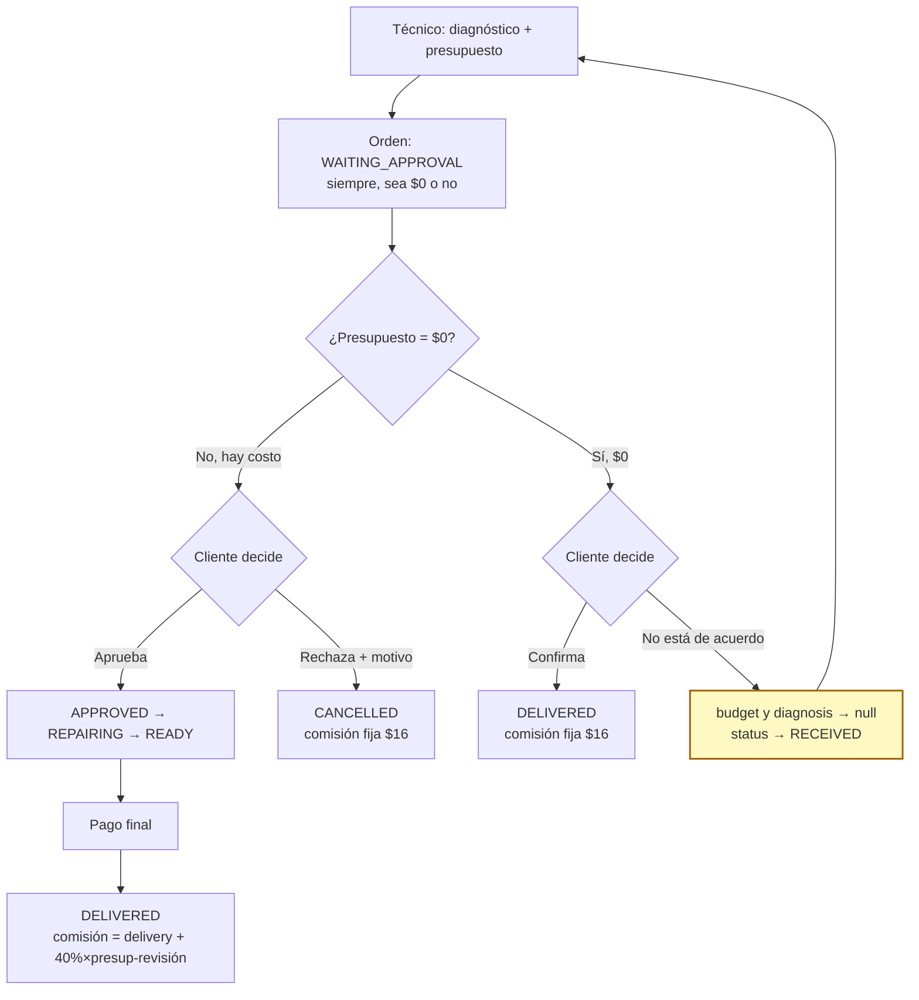
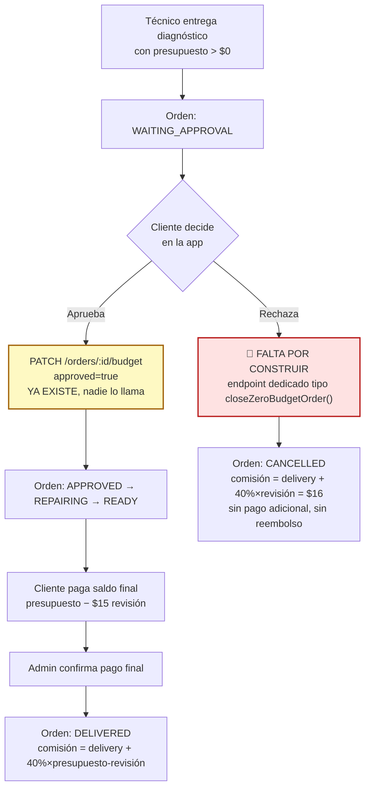

# Flujo faltante: cliente aprueba/rechaza el presupuesto (WAITING_APPROVAL)

## El hueco confirmado

`PATCH /api/orders/:id/budget` (`updateOrderBudget`) existe en el backend y en
el cliente API del móvil, pero **nadie lo llama** desde ninguna pantalla. Hoy,
en cuanto el técnico manda un presupuesto > $0, la orden queda en
`WAITING_APPROVAL` para siempre — no hay botón en la app del cliente, ni en
el admin, para sacarla de ahí.

Esto contradice tu propia Figura 5 del Trabajo de Grado ("¿Cliente aprueba el
presupuesto en la app? Sí/No"), que ya documenta que la decisión es del
cliente, en la app.

## Lo que ya confirmamos

- **Quién decide:** el cliente, en la app (no el admin) — coincide con Figura 5.
- **Comisión si rechaza:** igual que el caso presupuesto $0 → `deliveryAmount + 0.40 × revisionAmount` = **$16 fijo**, sin importar cuál era el presupuesto rechazado.
- **Dinero:** los $25 (delivery $10 + revisión $15) ya están cobrados y confirmados por el admin *antes* de que el técnico salga — eso no cambia. Si el cliente rechaza, no se cobra nada más, no hay reembolso.
- **Automático en ambos paneles:** el admin y el técnico deben ver la orden reflejarse sola, sin tocar código de esos paneles.

## Actualización — flujo unificado (v2, tras revisar con Raymar)

El diagnóstico (texto libre, ya existe) sigue siendo 100% del técnico — es
donde confirma qué tiene realmente el equipo y si se puede reparar. Lo único
nuevo es la capa de decisión encima: **el cliente decide siempre, para
cualquier presupuesto, incluido $0**. Hoy `submitDiagnosis()` salta
`WAITING_APPROVAL` cuando `budget === 0` y lo cierra directo un botón de
ADMIN (`closeZeroBudgetOrder`) — el cliente nunca ve ni confirma eso. Se
corrige: **`submitDiagnosis()` manda siempre a `WAITING_APPROVAL`**, sea $0
o no, y el cliente decide en los dos casos:

- **Presupuesto > $0:** Aprobar (sigue a reparación) / Rechazar con motivo (Task 1-4, sin cambios).
- **Presupuesto = $0** ("nada que reparar"): **Confirmar** (cierra la orden, `DELIVERED`, comisión $16 — mismo resultado que hoy pero lo dispara el cliente) / **No estoy de acuerdo** (confirmado con Raymar: la orden vuelve al técnico para un nuevo diagnóstico — se limpian `budget` y `diagnosis`, reutiliza el mismo formulario "Registrar diagnóstico" que ya existe en el panel del técnico, sin pantallas nuevas).

Técnico y admin ven todo esto reflejado solo por status + `statusHistory`
(sin botón propio para ellos en esta decisión — confirmado). El
`closeZeroBudgetOrder` de ADMIN se queda como está, como válvula de escape
manual (ej. cliente inubicable).



## Diagrama del flujo completo (con la pieza que falta en rojo) — v1, referencia histórica



## Por qué reutilizar el status `CANCELLED` (mi recomendación)

Miré cómo usa el resto del código el status `CANCELLED` de una orden de
servicio hoy — **nadie lo asigna automáticamente todavía**, solo existe como
opción manual en el selector libre del técnico. Pero el **panel de admin ya
lo trata como "orden cerrada"**, exactamente igual que `DELIVERED`:

```ts
// admin-web Dashboard.tsx:421 — ya existente, sin tocar
(o) => o.status === 'DELIVERED' || o.status === 'CANCELLED'
```

Y el panel del técnico separa "activas" de "completadas" mirando si
`technicianCommission != null` — no el status. Es decir: **si el nuevo
endpoint pone bien `status: CANCELLED` + `technicianCommission: 16`, la
orden se mueve sola a "cerradas" en el admin y a "completadas" en el técnico,
sin tocar ni una línea de esos dos paneles.**

### Opción A — Reutilizar `CANCELLED` (recomendada)
Un endpoint nuevo y dedicado, **`rejectBudget()`**, con la misma forma que
`closeZeroBudgetOrder()` que ya existe (mismo archivo `orders.service.ts`):
solo válido si `status === WAITING_APPROVAL`, pone `status: CANCELLED`,
calcula la comisión, decrementa la carga del técnico, notifica al cliente,
dice en el `statusHistory` exactamente por qué se canceló (para
diferenciarlo de cualquier otra cancelación futura).

- ✅ Cero cambios en Prisma (no hay migración).
- ✅ Cero cambios en los paneles de admin/técnico — ya filtran `CANCELLED` como cerrada.
- ✅ Coincide literal con tu Figura 5 ("Fin: orden cancelada").
- ⚠️ El texto "Cancelada" en rojo no distingue por qué (rechazo de presupuesto vs. otro motivo) — se resuelve con el comentario del `statusHistory`, que ya se muestra en el historial de la orden tanto al cliente como al técnico.

### Opción B — Status nuevo (ej. `REPAIR_DECLINED`)
Semánticamente más preciso (no se confunde con "cancelada por otro motivo"),
pero: requiere migración de Prisma, tocar el enum en 3 archivos más
(`statusBadge.ts`, dropdown del técnico, mensajes del chatbot), y **el panel
de admin no lo reconocería como "cerrada"** hasta que también le agregue ese
status al filtro — un cambio más grande para el mismo resultado.

**Mi recomendación es la Opción A** — mismo resultado visible para ti y
mucho menos superficie de cambio. La diferenciación por motivo queda en el
`statusHistory`, que es justo el mecanismo que el proyecto ya usa para eso
(ej. "Diagnóstico registrado... sin costo" vs "Presupuesto aprobado por el
cliente").

## Confirmado tras revisar los dos ejemplos de Raymar

- **`finalPaymentConfirmedAt` hay que ponerlo igual que `closeZeroBudgetOrder()`.**
  El resumen semanal/mensual del técnico (no el total general) filtra por esa
  fecha, no por `status`. Si `rejectBudget()` no la pone, la comisión de $16
  aparece en el total pero desaparece de los resúmenes por período. Ya
  identificado, se copia el mismo patrón.
- **La tienda de repuestos (`select-linked-products.tsx`) es un flujo aparte,
  no reemplaza esto.** Deja comprar piezas (`requiresInstallation`) vinculadas
  a la orden en cualquier momento que `budget > 0` — crea su propio
  `ProductOrder`. Los dos ejemplos de Raymar (presupuesto muy caro / no es
  reparación sino batería-cargador) se resuelven **igual en dinero**
  (comisión $16, sin cobro extra), así que un solo endpoint de rechazo cubre
  ambos — lo único que cambia entre los dos es el **motivo**, que sí hay que
  capturar.
- **El cliente elige un motivo al rechazar** (confirmado): selector corto +
  campo libre opcional, guardado en el `statusHistory` de la orden.

## Decisiones — todas cerradas

1. ✅ Opción A: `CANCELLED` + endpoint dedicado `rejectBudget()`.
2. ✅ Motivos: *"Es muy costoso"* / *"Prefiero resolverlo por mi cuenta"* / *"Otro"* (con campo de texto libre si elige "Otro").
3. Texto tras rechazar: *"Entendido, no se realizará la reparación. Ya pagaste la revisión y el delivery — no se te cobrará nada más."*
4. El botón "Rechazar" pide confirmación (`useConfirm`, mismo patrón que el pago anticipado) antes de ejecutar — es una decisión de dinero irreversible.

## Diseño técnico

### ⚠️ Corrección de seguridad (encontrada al escribir el plan)

`PATCH /:id/budget` está registrada como **`authorize('ADMIN')`** solamente
(`orders.routes.ts:48`) — el cliente no puede llamarla, y aunque pudiera,
`updateOrderBudget()` no valida que la orden sea suya (a diferencia de
`submitAdvancePaymentInstallment`, que sí resuelve `clientId` desde el
token). Esa ruta se queda como está, para uso de ADMIN/técnico editando el
presupuesto. En su lugar, **dos endpoints nuevos, client-only, con
verificación de dueño**, mismo patrón que el resto de acciones del cliente:

- `POST /:id/approve-budget` (CLIENT) — no toca el monto, solo aprueba.
- `POST /:id/reject-budget` (CLIENT) — el `rejectBudget()` ya diseñado abajo.

### Backend (`server/src/modules/orders/`)

**`orders.service.ts` — nueva función `approveBudget()`** (client-only,
no toca el monto):

```ts
export const approveBudget = async (id: string, email: string) => {
  const user = await prisma.user.findUnique({ where: { email }, select: { clientId: true } })
  if (!user || !user.clientId) throw new Error('Cliente no encontrado para este usuario')

  const order = await prisma.order.findFirst({ where: { id, clientId: user.clientId } })
  if (!order) throw new Error('Orden no encontrada')
  if (order.status !== 'WAITING_APPROVAL') {
    throw new Error('Esta acción solo aplica a órdenes esperando aprobación de presupuesto')
  }

  return await prisma.order.update({
    where: { id },
    data: {
      budgetApproved: true,
      status: 'APPROVED',
      statusHistory: {
        create: {
          status: 'APPROVED',
          comment: `Presupuesto de $${order.budget} aprobado por el cliente en la app`,
        },
      },
    },
    include: {
      client: true,
      device: true,
      technician: { select: { id: true, name: true } },
      statusHistory: { orderBy: { createdAt: 'desc' } },
    },
  })
}
```

**`orders.service.ts` — nueva función `rejectBudget()`**, gemela de
`closeZeroBudgetOrder()` pero client-only con verificación de dueño:

```ts
export const rejectBudget = async (
  id: string,
  email: string,
  reason: string,        // "Es muy costoso" | "Prefiero resolverlo por mi cuenta" | texto libre si "Otro"
) => {
  const user = await prisma.user.findUnique({ where: { email }, select: { clientId: true } })
  if (!user || !user.clientId) throw new Error('Cliente no encontrado para este usuario')

  const order = await prisma.order.findFirst({
    where: { id, clientId: user.clientId },
    include: { client: { include: { user: true } } },
  })
  if (!order) throw new Error('Orden no encontrada')
  if (order.status !== 'WAITING_APPROVAL') {
    throw new Error('Esta acción solo aplica a órdenes esperando aprobación de presupuesto')
  }

  const deliveryAmount = order.deliveryAmount ? Number(order.deliveryAmount) : 0
  const revisionAmount = order.revisionAmount ? Number(order.revisionAmount) : 0
  const commission = deliveryAmount + 0.4 * revisionAmount   // mismo cálculo que closeZeroBudgetOrder

  const updatedOrder = await prisma.order.update({
    where: { id },
    data: {
      budgetApproved: false,
      finalPaymentConfirmed: true,        // nada más que cobrar
      finalPaymentConfirmedAt: new Date(), // clave para el resumen semanal/mensual del técnico
      technicianCommission: commission,
      status: 'CANCELLED',
      statusHistory: {
        create: {
          status: 'CANCELLED',
          comment: `Cliente rechazó el presupuesto de $${order.budget}. Motivo: ${reason}. Comisión del técnico: $${commission.toFixed(2)} (delivery + 40% revisión).`,
        },
      },
    },
    include: { client: true, device: true, technician: { select: { id: true, name: true } }, statusHistory: { orderBy: { createdAt: 'desc' } } },
  })

  if (order.technicianId) await decrementTechnicianLoad(order.technicianId)

  if (order.client.user) {
    await prisma.notification.create({
      data: {
        type: 'STATUS_CHANGE',
        channel: 'PUSH',
        message: `Confirmamos que no se realizará la reparación de la orden #${order.orderNumber}. No se te cobrará nada adicional.`,
        userId: order.client.user.id,
        orderId: id,
      },
    })
  }

  return updatedOrder
}
```

**Rutas nuevas** (`orders.routes.ts`, junto a las demás rutas de CLIENT):
```ts
router.post('/:id/approve-budget', authenticate, authorize('CLIENT'), ordersController.approveBudget)
router.post('/:id/reject-budget', authenticate, authorize('CLIENT'), ordersController.rejectBudget)
```

### Backend — nuevo: confirmación del diagnóstico $0

**`submitDiagnosis()` — cambiar la línea del status:**
```ts
// antes: const nextStatus = hasCost ? 'WAITING_APPROVAL' : 'READY'
const nextStatus = 'WAITING_APPROVAL' // siempre — el cliente decide en los dos casos
```
(el resto de la función no cambia — `budgetApproved: hasCost ? undefined : true`
también se quita, ya no se auto-aprueba nada, lo decide el cliente)

**`orders.service.ts` — nueva función `confirmZeroBudgetDiagnosis()`**
(cliente confirma "nada que reparar", mismo cálculo de comisión que
`closeZeroBudgetOrder`, pero client-only con verificación de dueño):
```ts
export const confirmZeroBudgetDiagnosis = async (id: string, email: string) => {
  const user = await prisma.user.findUnique({ where: { email }, select: { clientId: true } })
  if (!user || !user.clientId) throw new Error('Cliente no encontrado para este usuario')

  const order = await prisma.order.findFirst({ where: { id, clientId: user.clientId } })
  if (!order) throw new Error('Orden no encontrada')
  if (order.status !== 'WAITING_APPROVAL') {
    throw new Error('Esta acción solo aplica a órdenes esperando aprobación de presupuesto')
  }
  if (Number(order.budget) !== 0) {
    throw new Error('Esta acción solo aplica a diagnósticos sin costo')
  }

  const deliveryAmount = order.deliveryAmount ? Number(order.deliveryAmount) : 0
  const revisionAmount = order.revisionAmount ? Number(order.revisionAmount) : 0
  const commission = deliveryAmount + 0.4 * revisionAmount

  return await prisma.order.update({
    where: { id },
    data: {
      budgetApproved: true,
      finalPaymentConfirmed: true,
      finalPaymentConfirmedAt: new Date(),
      technicianCommission: commission,
      status: 'DELIVERED',
      deliveredAt: new Date(),
      statusHistory: {
        create: {
          status: 'DELIVERED',
          comment: `Cliente confirmó el diagnóstico — no requiere reparación. Comisión del técnico: $${commission.toFixed(2)}.`,
        },
      },
    },
    include: { client: true, device: true, technician: { select: { id: true, name: true } }, statusHistory: { orderBy: { createdAt: 'desc' } } },
  })
  // decrementTechnicianLoad + notificación al cliente, igual que closeZeroBudgetOrder
}
```

**`orders.service.ts` — nueva función `disputeZeroBudgetDiagnosis()`**
(cliente no está de acuerdo → vuelve al técnico):
```ts
export const disputeZeroBudgetDiagnosis = async (id: string, email: string, note?: string) => {
  const user = await prisma.user.findUnique({ where: { email }, select: { clientId: true } })
  if (!user || !user.clientId) throw new Error('Cliente no encontrado para este usuario')

  const order = await prisma.order.findFirst({ where: { id, clientId: user.clientId } })
  if (!order) throw new Error('Orden no encontrada')
  if (order.status !== 'WAITING_APPROVAL') {
    throw new Error('Esta acción solo aplica a órdenes esperando aprobación de presupuesto')
  }
  if (Number(order.budget) !== 0) {
    throw new Error('Esta acción solo aplica a diagnósticos sin costo')
  }

  return await prisma.order.update({
    where: { id },
    data: {
      budget: null,
      diagnosis: null,
      status: 'RECEIVED',
      statusHistory: {
        create: {
          status: 'RECEIVED',
          comment: `Cliente no estuvo de acuerdo con el diagnóstico (sin costo) — solicitó nueva revisión.${note ? ` Nota: ${note}` : ''}`,
        },
      },
    },
    include: { client: true, device: true, technician: { select: { id: true, name: true } }, statusHistory: { orderBy: { createdAt: 'desc' } } },
  })
  // sin decrementTechnicianLoad — la orden sigue activa para el mismo técnico
}
```

**Rutas nuevas:**
```ts
router.post('/:id/confirm-zero-budget-diagnosis', authenticate, authorize('CLIENT'), ordersController.confirmZeroBudgetDiagnosis)
router.post('/:id/dispute-zero-budget-diagnosis', authenticate, authorize('CLIENT'), ordersController.disputeZeroBudgetDiagnosis)
```

`closeZeroBudgetOrder` (ADMIN) se queda igual, sin tocar — válvula de escape manual.

### Mobile (`apps/mobile`)

**`src/services/api.ts`** — agregar `approveBudget(orderId)` y
`rejectBudget(orderId, reason)` (el `updateOrderBudget` existente se deja
como está, es ADMIN-only).

**`app/(client)/my-technical-orders.tsx`** — en el bloque expandido, cuando
`status === 'WAITING_APPROVAL'`, dos variantes según `budget`:

- **`budget > 0`:** presupuesto + **"✅ Aprobar presupuesto"**
  (`useConfirm()` → `approveBudget(id)`) y **"❌ Rechazar presupuesto"**
  (selector de motivo inline → `useConfirm()` → `rejectBudget(id, reason)`).
- **`budget === 0`:** texto del diagnóstico + **"✅ Confirmar diagnóstico"**
  (`useConfirm()` → `confirmZeroBudgetDiagnosis(id)`) y **"🔁 No estoy de
  acuerdo, pedir nueva revisión"** (`useConfirm()` →
  `disputeZeroBudgetDiagnosis(id)`).

Todos con `fetchOrders()` al terminar, igual que el resto de acciones de
esta pantalla.

### Tests (`server/src/__tests__/orders.test.ts`)

Casos a cubrir, mismo estilo que los tests existentes de
`closeZeroBudgetOrder`:
- Aprobar/rechazar/confirmar/disputar válido desde `WAITING_APPROVAL`.
- Cada acción desde cualquier otro status → error.
- `confirmZeroBudgetDiagnosis`/`rejectBudget` con `budget != 0`/`=== 0` mal aplicado → error (ej. confirmar-$0 sobre una orden con `budget=50`).
- Rechazo: `CANCELLED`, comisión $16, `finalPaymentConfirmedAt` seteado, `decrementTechnicianLoad` llamado.
- Confirmar $0: `DELIVERED`, comisión $16, `finalPaymentConfirmedAt` seteado.
- Disputar $0: `budget`/`diagnosis` vuelven a `null`, status `RECEIVED`, el técnico sigue asignado (sin `decrementTechnicianLoad`).
- Ownership: cliente B no puede actuar sobre una orden de cliente A, en las 4 funciones.
